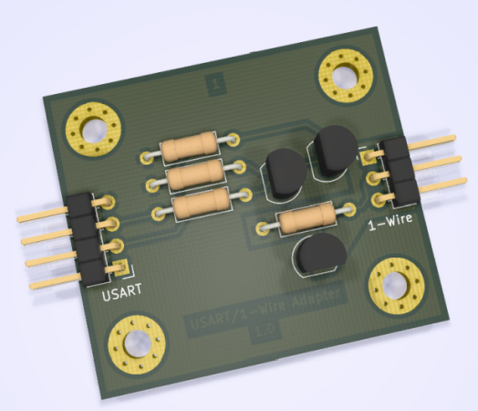

# 1-Wire Adapter

## Table of Contents

- [1-Wire Adapter](#1-wire-adapter)
  - [Table of Contents](#table-of-contents)
  - [About](#about)
  - [History](#history)
  - [Maintainer](#maintainer)

## About

Small extension for an USART interface to use it as a 1-Wire interface.

## History

| **Version**  | **Description**                            | **Date**   |
|:------------:|:------------------------------------------:|:----------:|
| 1.0          | First hardware release                     | 29.01.2019 |

## Maintainer

- [Daniel Kampert](DanielKampert@kampis-elektroecke.de)
